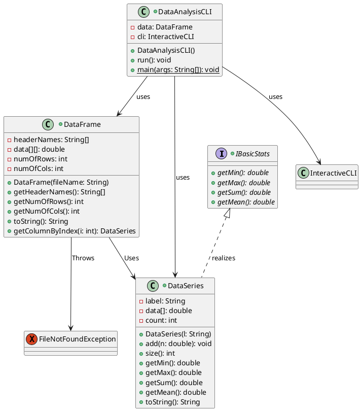
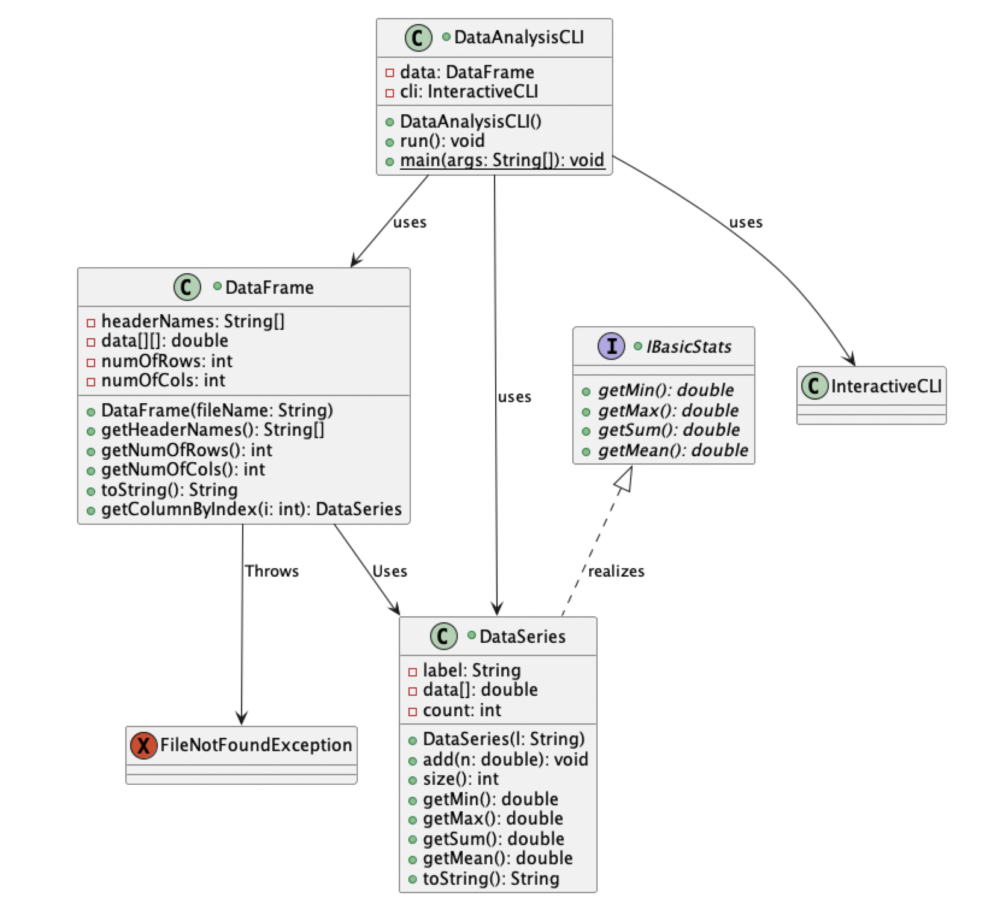
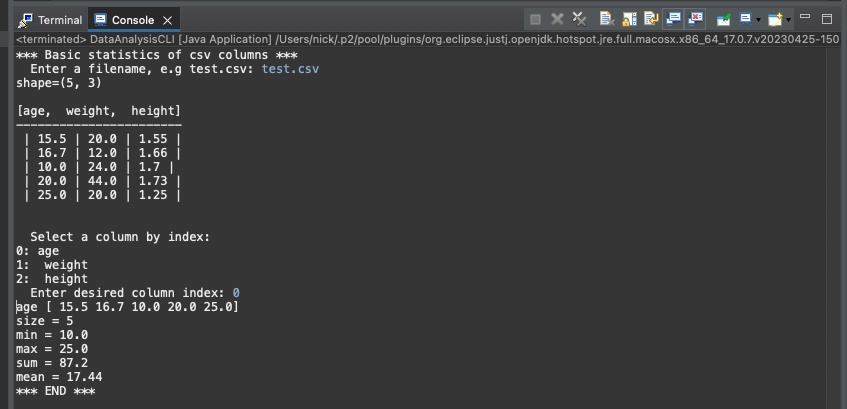
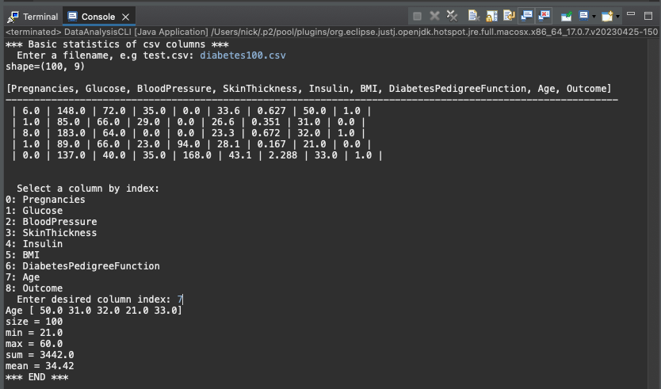
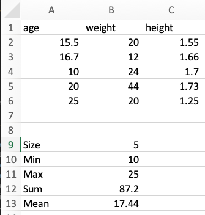
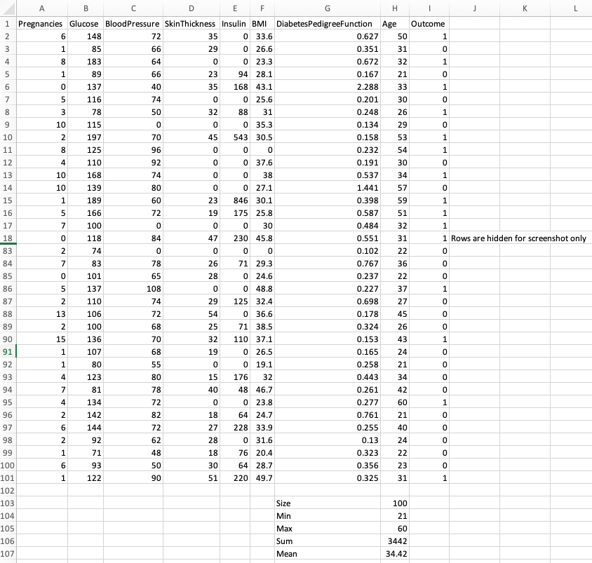

# Data Analysis report
Author: Nick Nikolov

## UML class diagram

This screenshot shows the UML diagram for the DataAnalysis program

## Execution and Testing
This screenshot shows successful execution of the Stats program using the test.csv with age as the input column

This screenshot shows successful execution of the Stats program using the diabetes100.csv with age as the input column

## Verification of statistics
Verification of statistics is shown in diabetes100Confirmation.xls and testConfirmation.xls, screenshots shown below

This screenshot shows successful confirmation of the Test.csv dataset using excel

This screenshot shows successful confirmation of the diabetes100.csv dataset using excel

# Reflection
DataAnalysis - I liked learning about how to manually do many of the python data analysis functions I've been using.

TextAnalysis - I liked learning more in depth about the GUI after editing some components. Interesting to format output to the user.
