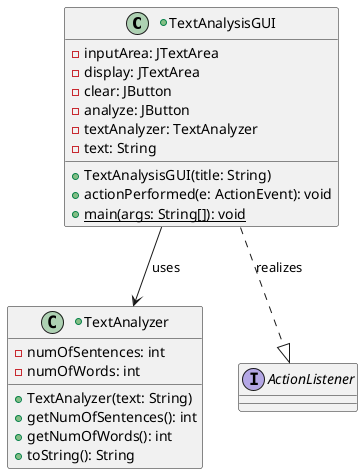
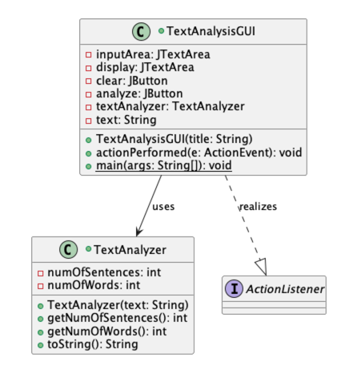
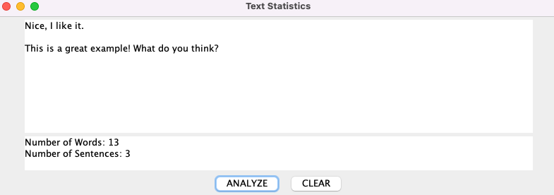
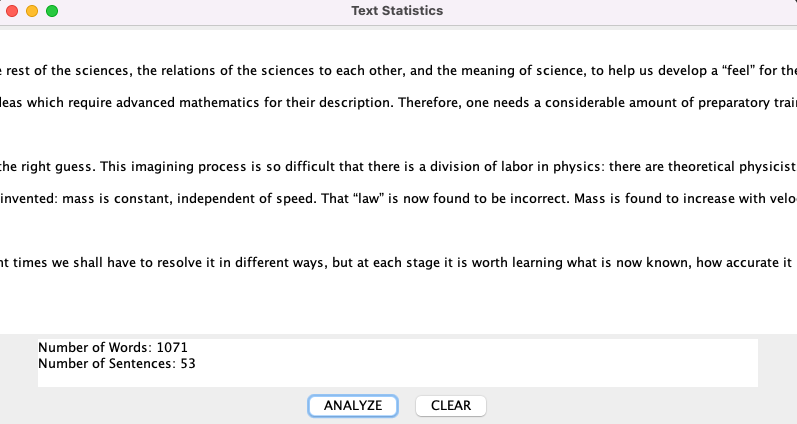

# Text Analysis report
Author: Nick Nikolov

## UML class diagram

This screenshot shows the PlantUML diagram for the TextAnalysisGUI and TextAnalyzer classes

## Execution and Testing

This screenshot shows successful execution of the TextAnalysis program using the test.txt string

This screenshot shows successful execution of the TextAnalysis program using the feynman.txt string

